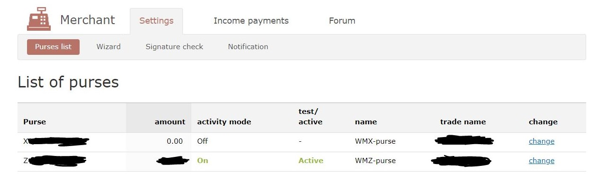

# RCP WEBMONEY

This plugin can be used as a manual gateway for the wordpress plugin: **Restrict Content Pro**.

Please *Note That* this works only for the newer versions of RCP **>= 3.0** probably.

---
---

## WEBMONEY

Webmoney is something like PayPal. please visit their site at: \
https://www.wmtransfer.com/

You can see and congigure your **purses** after creating a personal/merchant account here: \
https://merchant.wmtransfer.com/conf/purses.asp

 

In this URL, click on setting tab:

There are probably two purses in the list:

- WMX-purse: A bitcoin-based purse that its ID starts with X

- WMZ-purse: A dollar-based purse (USD) that its ID starts with Z

So it is important you know that you **cannot** set the **currency-type** in the payment requesting-form. \
Actually you should add the **purse-id** to the request-form. each purse is a representative of the currency-type.

For changing the options and fields of each purse, click on the *change* button on the right side of the rows.

---

### NOTES

1. You can set the **working-mode** to `test` or `work` (active) in the merchant panel (required). If you disable this field, the users can't pay to your purse from your website!

2. You should definitely set the **secret key**. this field is used for verification of the payment after receiving the response-form from the webmoney gateway (required)

3. Enable the option: **Let to use URL sent in form**.  (required)

4. Enable the option: **Send notification to Result URL in case of payment error** (optional)

5. Set the **Control sign forming method** to `SHA256`. (required). This is very important; this plugin uses the *sha256* hash method.

---

### HOW TO ADD THIS PLUGIN TO WORDPRESS

Just *Download (Compressed)* this repo and *Upload* it to the plugin sections of your wordpress panel. Then activate it. It will automatically be added to the RCP plugin. **You MUST set the fields of this plugin in RCP Setting**!

WebMoney plugin fields in RCP Setting (IN WORDPRESS PANEL):

- **Purse ID**
- **Secret Key** (must match the secret key you added to the merchant panel of webmoney website)
- **Payment Description**
- **Fail URL** (returning-page URL of your website when the payment fails)
- **Success URL** (returning-page URL of your website when the payment is successful)

---

#### FEEL FREE TO CONTRIBUTE 💛
